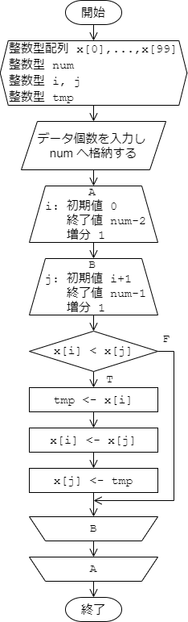

# 配列

### 例題1. 配列の内容と総和の表示
````c
#include <stdio.h>

int main(void) {
  // initialize all array elements data[0]~data[4]
  double data[5] = {1.2, 3.4, -5.6, 7.8, -9.0};
  double total;

  // display the array elements
  for (int i = 0; i < 5; ++i) {
    printf("data[%2d] = %4.2f\n", i, data[i]);
  }

  // sum of the array elements
  total = 0.0;
  for (int i = 0; i < 5; ++i) {
    total += data[i];
  }
  printf("total = %4.2f\n", total);

  return 0;
}

````

実行例
````
data[ 0] = 1.20
data[ 1] = 3.40
data[ 2] = -5.60
data[ 3] = 7.80
data[ 4] = -9.00
total = -2.20
````

### 例題2. 入力データを逆順で出力する
````c
#include <stdio.h>

#define MAX_NUM 20

int main()
{
  int score[MAX_NUM]; // int score[20];
  int num;

  // input number of students
  scanf("%d", &num); // !! value num should be less than or equal to MAX_NUM
  // input score of students
  for (int i = 0; i < num; ++i) {
    scanf("%d", &score[i]);
  }

  // output scores in reverse order
  printf("*reverse order*\n");
  for (int i = num - 1; i >= 0; --i) {
    printf("%d ", score[i]);
  }
  printf("\n");

  return 0;
}
````

実行例 (>の行は標準入力からの入力を示す)
````
> 5
> 31 41 59 26 53
*reverse order*
53 26 59 41 31
````
### 例題3. バブルソート


````c
#include <stdio.h>

#define MAX_SIZE 50

int main(void) {
  int data[MAX_SIZE]; // prepare the array data[0] ~ data[MAX_SIZE - 1]
  int number_of_data;
  int tmp; // tempora

  // input number of data
  scanf("%d", &number_of_data); //!! Assert number_of_data <= MAX_SIZE
  // input data
  for (int i = 0; i < number_of_data; ++i) {
    scanf("%d", &data[i]);
  }

  // Bubble sort algorithm
  for (int i = number_of_data - 2; i >= 0; --i) {
    for (int j = 0; j <= i; ++j) {
      if (data[j] > data[j + 1]) {
        // swap data[j], data[j + 1]
        tmp         = data[j];
        data[j]     = data[j + 1];
        data[j + 1] = tmp;
      }
    }
  }

  // output the result
  for (int i = 0; i < number_of_data; ++i) {
    printf("%d ", data[i]);
  }
  printf("\n");

  return 0;
}
````

動作例
````
>10
>3 1 4 1 5 9 2 6 5 3
1 1 2 3 3 4 5 5 6 9
````

### 課題1. 奇数・偶数の分類
10個の整数を入力すると、奇数と偶数に分けて表示するプログラムを作成せよ。

動作例：
````
>21 22 34 83 -20 9 -3 91 32 4
Odd : 21 83 9 -3 91
Even: 22 34 -20 32 4
````

### 課題2. ソートアルゴリズム
データの個数 n を入力後、続けて n 個の整数値を入力すると、
入力した n 個の整数値を昇順に並べ替えて表示するプログラムを作成せよ。
ただし、 データの個数 n は最大でも 100 とする。
なお、昇順に並べ替える部分の手順は下記のフローチャートに基づくこと。
フローチャートでは n 個の整数値の入力部分と、並べ替えた結果の出力部分は省略されているので注意すること。



動作例
````
>10
>3 1 4 1 5 9 2 6 5 3
1 1 2 3 3 4 5 5 6 9
````

