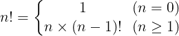
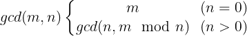
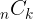
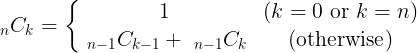

# 再帰関数

## 再帰関数

### 例題 1. 階乗
$n$ を 0 以上の整数とするとき、その階乗 $n!$ について次の再帰式が成り立つ。




````C
#include <stdio.h>

int factorial(int n);

int main(void) {
  int n;
  printf("input n : ");
  scanf("%d", &n);

  printf("%d! = %d\n", n, factorial(n));

  return 0;
}

int factorial(int n) {
  if (n == 0) {
    return 1;
  } else {
    return n * factorial(n - 1);
  }
}
````

[実行例]

````
input n : 10
10! = 3628800

````

###  2 つの整数の最大公約数を再帰により求める

ユークリッドの互除法: m と n (m は 1 以上の整数、n は 0 以上 m 以下の整数)の最大公約数を gcd(m, n) と書くと次の再帰式が成り立つ。



````C
#include <stdio.h>

int gcd(int m, int n);

int main(void) {
  int m = 24;
  int n = 18;

  int gcd_answer = gcd(m, n);
  printf("gcd(%d, %d) = %d\n", m, n, gcd_answer);

  return 0;
}

int gcd(int m, int n) {
  printf("<gcd(%d, %d) is called>\n", m, n);

  if (n == 0) {
    return m;
  } else {
    return gcd(n, m % n);
  }
}
````

[実行例]
````
<gcd(24, 18) is called>
<gcd(18, 6) is called>
<gcd(6, 0) is called>
gcd(24, 18) = 6

````

### 例題 3. ハノイの塔

````C 
#include <stdio.h>

void hanoi(int n, const char* from, const char* to, const char* work);

int main(void) {

  hanoi(3, "Left", "Center", "Right");

  return 0;
}

void hanoi(int n, const char* from, const char* to, const char* work) {
  if (n > 0) {
    hanoi(n - 1, from, work, to);
    printf("move %dth disk from %s to %s\n", n, from, to);
    hanoi(n - 1, work, to, from);
  }
}
````

[実行例]
````
move 1th disk from Left to Center
move 2th disk from Left to Right
move 1th disk from Center to Right
move 3th disk from Left to Center
move 1th disk from Right to Left
move 2th disk from Right to Center
move 1th disk from Left to Center

````

## 課題 1. 組み合わせの数

異なる n 個 ( n は 0 以上の整数) のアイテムから k 個 ( k は 0 以上 k 以下の整数) のアイテムを取り出すときの組み合わせの数  について、次の再帰式が成り立つ。



この再帰式に基づいて  を計算する関数 ``combination(n, k)`` を定義し、その動作を確認せよ。
関数 ``combination(n, k)`` の関数プロトタイプ宣言、返値、引数については以下のように与えられるものとする。

関数プロトタイプ宣言:
````C
int combination(int n, int k);
````

返値:   

引数:

|引数|説明|
|--:|--|
|n | 0 以上の整数 |
|k | 0 以上 n 以下の整数 |

